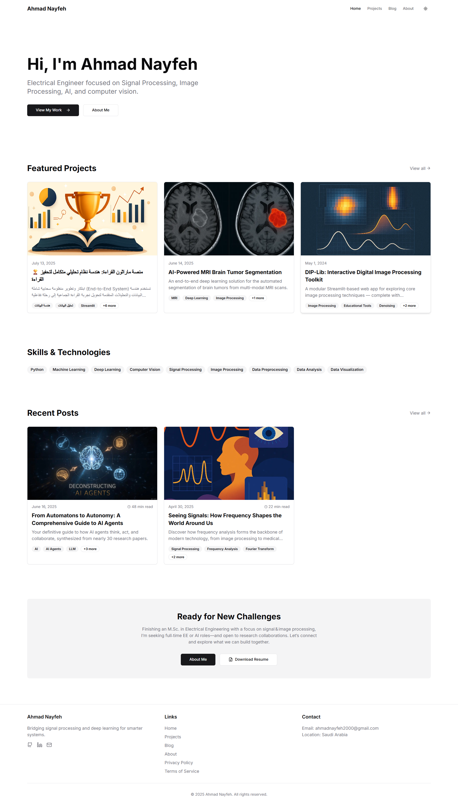

# 🚀 Ahmad Nayfeh's Portfolio

A modern portfolio website showcasing my projects, experience, and articles in **Artificial Intelligence**, **Data Science**, and **Signal & Image Processing**.

  

## 🏛️ Architectural Philosophy

This website was designed with a **"Separation of Content from Presentation"** philosophy. Instead of hard-coding content directly into the UI components, it's managed entirely through simple **Markdown** and **YAML** files. This approach provides several key advantages:

- **📝 Ease of Updates:** Projects, articles, and bio information can be added or modified quickly without any coding knowledge.
- **🔄 Flexibility:** The entire website's design can be overhauled in the future without affecting the content.
- **⚡ Performance:** This architecture allows for pre-building pages into static assets (Static Site Generation), ensuring blazing-fast load times.

## ✨ Key Features

| Feature | Description |
|---------|-------------|
| 🎨 **Modern & Responsive Design** | A sleek user interface that works flawlessly across all devices, built with **Tailwind CSS** and **shadcn/ui** components. |
| 🌗 **Dark Mode Support** | A seamless theme-switching experience between light and dark modes, with the user's preference saved locally. |
| 📝 **File-Based Content Management** | All projects, blog posts, and personal information are managed through Markdown and YAML files. |
| ⚡ **High Performance** | Utilizes **Next.js** for Static Site Generation (SSG), ensuring fast page loads and excellent SEO. |
| 🔍 **Dynamic Filtering & Search** | The projects and blog pages include interactive filtering by tags and a live search functionality. |
| 🎨 **Customizable Pages** | The ability to use custom HTML and CSS within Markdown files to create unique layouts for each project. |

## 🛠️ Tech Stack

| Technology | Description |
|------------|-------------|
| **Framework** | [Next.js](https://nextjs.org/) 15 (App Router) |
| **Language** | [TypeScript](https://www.typescriptlang.org/) |
| **Styling** | [Tailwind CSS](https://tailwindcss.com/) |
| **UI Components** | [shadcn/ui](https://ui.shadcn.com/) |
| **Content Management** | [Markdown](https://www.markdownguide.org/) with `gray-matter` & [YAML](https://yaml.org/) with `js-yaml` |
| **Deployment** | [Vercel](https://vercel.com/) |

## 📬 Contact

